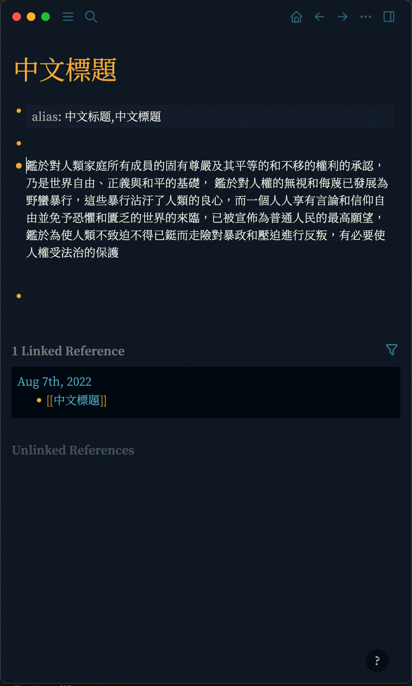
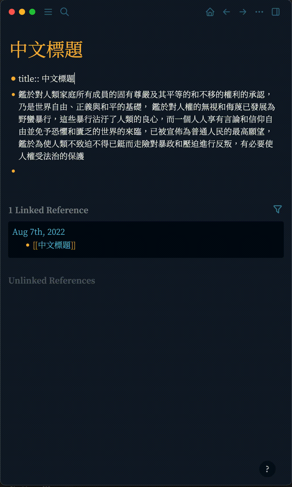

# logseq-chinese-tools

This logseq plugin enable you to 1): convert Chinese from simplified characters to tradtional characters as well traditional to simplified; 2): add different Chinese variant aliases to current page.
These can be done using simple slash commands, here are some demostrations:

